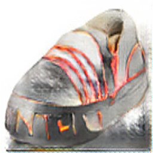

# Homework 2 (Style-Transfer)

## Training MUNIT

For training, we use the default demo config:
```
bash scripts/demo_train_summer2winter_yosemite256.sh
```
In this assignment, we use the `summer2winter_yosemite256` dataset (not the HD version), which is introduced in the UNIT paper. Which contains summer and winter street images extracted from real-world driving videos.

We show the tensorboard logging of the overall discriminator loss and generator loss below as an evidence of our training process (540k iter.).

D-Loss | G-Loss |
---    | ---  |
 |  |


iter. | Summer → Winter|
---    | ---  |
10k   |  |
20k   |  |
30k   |  |
110k  |  |
120k  |  |
130k  |  |
310k  |  |
320k  |  |
330k  |  |
540k  |  |


## Inference one image in multiple style

Input | Style-A | Style-B | Style-C | Style-D | Style-E | Style-F | Style-G |
---   | ---     | ---     | ---     | ---     | ---     | --- | --- |
 |  |  |  |  |  |  |  |  |  |  |


## Compare with other methods

First we compare the result to one CVPR'17 paper, pix2pix. Note that Pix2Pix can only do one → one mapping.

Input | Style-A |
---   | ---     |
 |  |

Another paper BicycleGAN can solve this problem (one → one mapping). 
Just like the `cycle consistency` we have tried in CycleGAN before, we have to add constraints on the consistency of the shared domain (Which is domain `Y`). As the table shown below, BicycleGAN integrate the `xy_Backward` loss and `yz_Forward` loss together as our special `bi-cycle-loss`. So that shared domain `Y` keeps the transform between `X` to `Z` adversarial. 

| Separate Cycles | Joint Cycles |
|:-----:|:---:|
|||

For fair comparions, we use the same testing image among all the methods.

Input | Encoded | Style-B | Style-C | Style-D | Style-E | Style-F | Style-G |
---   | ---     | ---     | ---     | ---     | ---     | --- | --- |
 |  |  |  |  |  |  |  |  |  |  |

The generated image quality from both MUNIT and Pix2Pix are good. However, as mentioned above, Pix2Pix only supports one to one mapping. Comparing to another one to many mapping method, BicycleGAN, the image quality generated by MUNIT clearly outperform the one generated by BicleGAN. Through recombining its `content code` with a random `style code` sampled from the style space of the target domain, MUNIT shows great advantage comparing to either Pix2Pix or BicycleGAN.
